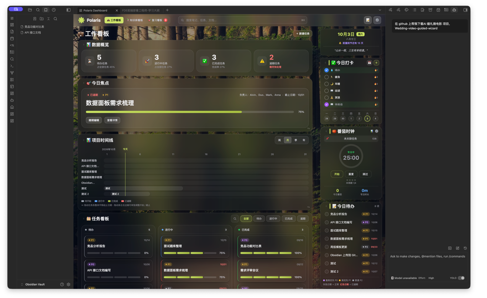
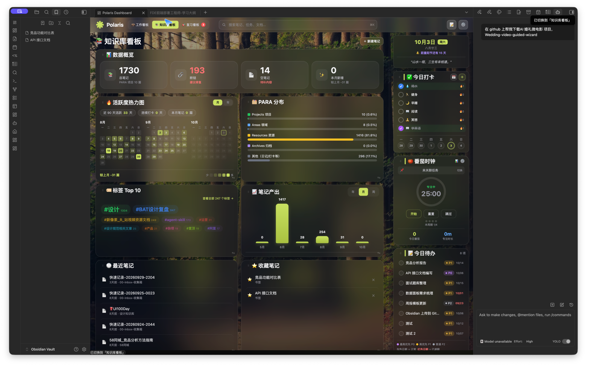
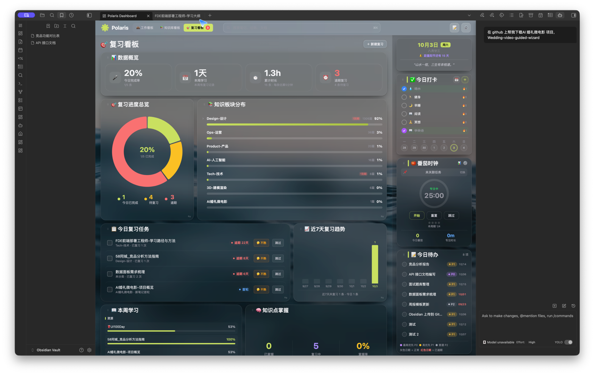

# 🌌 Polaris Dashboard · 北极星个人工作台

**Obsidian 个人工作台仪表盘插件** —— 把工作、知识、复习三大板块收进一个玻璃拟态仪表盘。

> Polaris Dashboard is an **Obsidian plugin** that brings a **glassmorphism personal dashboard** to your vault: work kanban, knowledge base, review tracker, pomodoro timer, gantt timeline and more — all in one home page.

> **English** · 中文请往下翻 ↓
>
> Polaris Dashboard turns your Obsidian vault into a beautiful glassmorphism command center with three boards:
>
> - **Work Board** — today's todos with priority tags (P0/P1/P2) and overdue highlighting, task kanban, focus items, and a draggable gantt project timeline (week/month/quarter/year).
> - **Knowledge Board** — activity heatmap, PARA distribution, top tags, weekly learning progress, daily habit check-ins and a calendar.
> - **Review Board** — review progress overview, knowledge area distribution, expected review planning and 7-day trends.
>
> It also includes a **pomodoro timer** (focus/break modes with statistics), a global note search bar, draggable card layouts, and a dark/light theme switcher. Requires **Obsidian 1.4+** and the **Dataview** community plugin.

[English](#english) · [中文](#中文)

---

## ✨ 功能特性 / Features

### 🗂️ 三大看板 / Three Boards
| 看板 | 内容 |
|---|---|
| 💼 工作看板 | 今日待办、今日焦点、任务看板（待办/进行中/已完成/逾期）、项目时间线甘特图 |
| 📚 知识库看板 | 数据概览、日历、今日打卡、本周学习、知识板块分布、笔记搜索 |
| 🔁 复习看板 | 复习进度总览、知识板块分布、预期复习规划 |

### ⚡ 核心能力 / Highlights
- **今日待办**：单行任务流，优先级胶囊（P0/P1/P2），逾期日期自动变红
- **番茄时钟**：专注/短休/长休模式，专注时长统计，本周期进度
- **今日打卡**：每日习惯打卡 + 周势图
- **项目时间线**：甘特图视图，支持周/月/季/年四档切换
- **本周学习**：按 项目 / 领域 / 资源 分组，学习进度条
- **数据概览**：今日完成率、本周学习、累计时长、预期复习，点击可下钻
- **顶部搜索**：全库笔记 / 断链 / 空笔记 / 本月新增，谷歌式连体下拉
- **可拖拽布局**：左右两栏卡片均可拖拽排序，右上角设置可开关各板块
- **双主题**：深色玻璃拟态 / 浅色模式，一键切换

---

## 📦 安装 / Installation

### 前提 / Prerequisites
- **Obsidian** 桌面版（v1.4+）
- 社区插件 **Dataview**（用于读取 Vault 内的任务/笔记数据）

### 方式一：手动安装
1. 下载本仓库的 `main.js` 与 `manifest.json`
2. 拷贝到你的笔记库：
   ```
   你的Vault/.obsidian/plugins/polaris-dashboard/
   ```
3. 重启 Obsidian，进入 设置 → 第三方插件 → 启用 **Polaris Dashboard**

### 方式二：源码构建
```bash
npm install
npm run build        # 产出 dist/main.js
```

> 插件通过 Dataview 读取**使用者自己的** Vault 数据，不含任何云端同步，你的笔记始终留在本地。

---

## 🖥️ 界面预览 / Preview

| 💼 工作看板 | 📚 知识库看板 |
|---|---|
|  |  |

| 🎯 复习看板 |
|---|
|  |

---

## 📚 配套文档 / Docs

| 文件 | 说明 |
|---|---|
| `DESIGN-SYSTEM.md` / `design-system.html` | 完整设计系统规范：色彩、圆角、按钮、间距、组件 |
| `PRODUCT-DOC.md` / `product-doc.html` | 产品功能说明文档 |
| `USER-GUIDE.md` | 用户指南 |

---

## 🛠️ 技术栈 / Tech Stack

TypeScript · esbuild · Obsidian API · Dataview · 原生 DOM/CSS（无框架）

---

## 👤 作者 / Author

**Alvin** — 个人效率工具爱好者，深耕 Obsidian 本地化工作流。

---

## 📄 许可 / License

© 2026 Alvin. 保留所有权利（All Rights Reserved）。
如需商用或二次分发，请联系作者。
